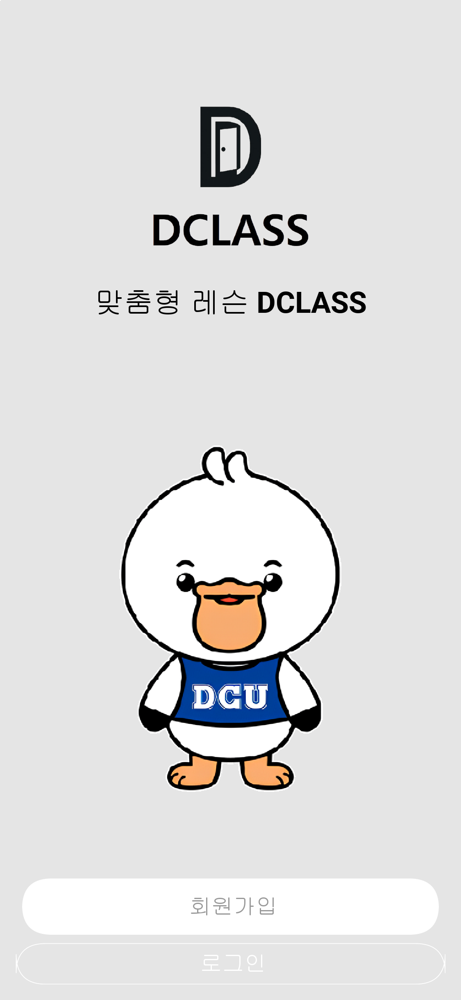
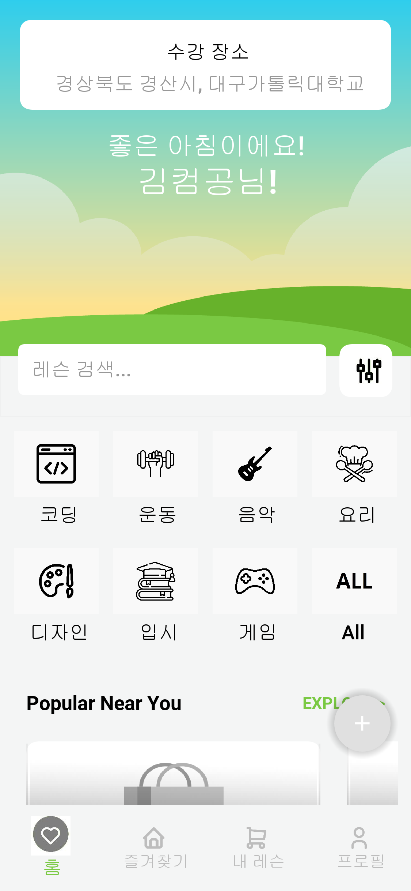
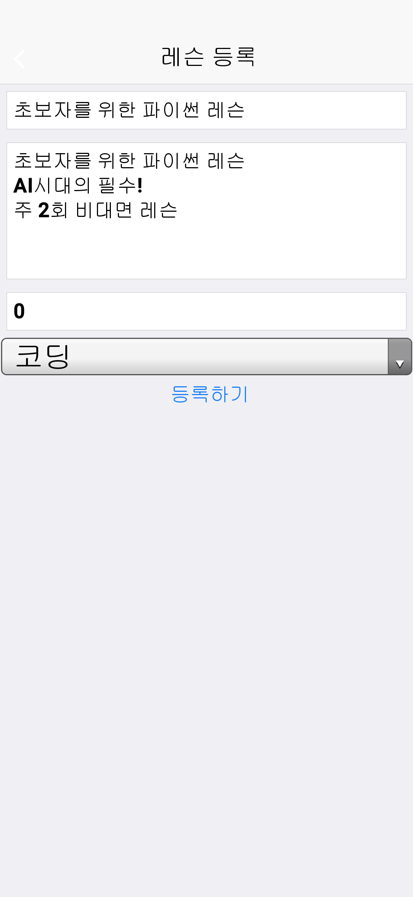
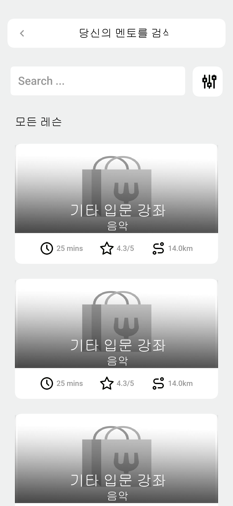
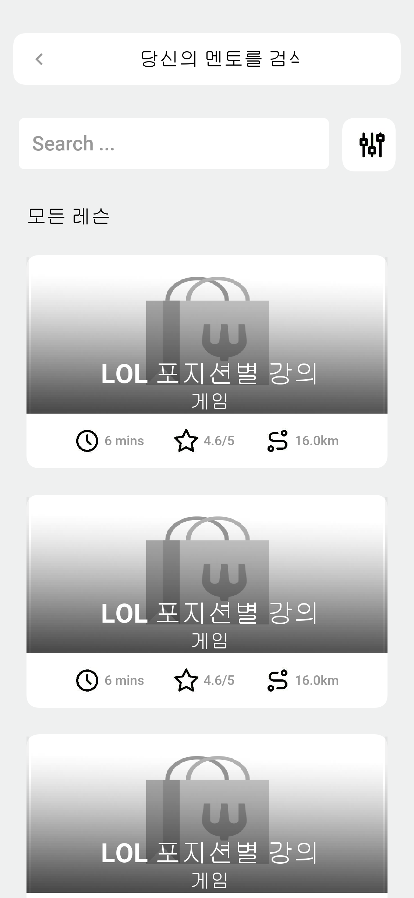

# Codename One UberEats Clone 기반 교육 플랫폼

이 프로젝트는 Codename One의 UberEatsClone 오픈소스 템플릿([원본 링크](https://github.com/sergeyCodenameOne/UberEatsClone))을 기반으로 제작된 졸업작품입니다.  
기존 음식 배달 앱 구조를 재해석하여, **교육 콘텐츠(레슨)를 등록하고 결제할 수 있는 학습 플랫폼**으로 커스터마이즈하였습니다.

---
## 📸 스크린샷

### 🔐 회원가입 및 로그인 화면 (`mainView.png`)
UI 재구성과 한글화 적용을 통해 기존 영어 기반 화면을 한국어 중심으로 수정하였습니다.

---

### 🏠 홈 화면 (`homeView.png`)
로그인한 사용자 정보를 상단에 표시하며, 전체 UI를 한글화 및 직관적으로 리디자인하였습니다.

---

### 📝 레슨 작성 화면 (`writeView.png`)
기존 음식 주문 작성 화면을 완전히 제거하고, 사용자 교육 콘텐츠 등록을 위한 레슨 작성 폼을 새로 구현하였습니다.

---

### 🎵 음악 카테고리 레슨 리스트 (`musicCategory.png`)
카테고리 분류 체계 도입 이후, 음악 관련 더미 레슨 데이터를 생성하여 리스트에 반영하였습니다.

---

### 🎮 게임 카테고리 레슨 리스트 (`gameCategory.png`)
카테고리 기반 필터 기능 구현 후, 게임 주제의 레슨 데이터도 따로 구성해 필터 테스트에 활용하였습니다.

---

## ✨ 커스터마이징 핵심 내용

- 🍱 기존 음식 주문 흐름 → 🎓 레슨 등록 및 결제 흐름으로 완전 전환
- 음식점 카드 UI → 레슨 카드 리스트로 변경
- 음식 상세보기 → 레슨 상세보기로 수정
- 음식 주문 기능 제거 및 레슨 작성 UI, 저장 기능 추가
- 카테고리 기반 레슨 필터링 기능 구현 (예: 코딩, 운동 등)
- ✅ **앱 전체 한글화 진행**
- ✅ **UI 및 뷰 수정**
- ✅ **기존에 분류되지 않던 카테고리 체계를 정의하여 정렬 가능하게 구성**
- ✅ **더미 레슨 데이터도 카테고리에 맞게 정제**
- ✅ **백엔드 서버 연동을 위한 Entity 구조 및 기초 API 설계 완료**

---

## 📱 주요 기능

- 사용자 회원가입 및 로그인
- 로그인한 사용자 이름 표시 (홈 화면 반영)
- 레슨 등록 (제목, 설명, 가격, 카테고리 입력)
- 등록된 레슨 리스트 카드 UI
- 레슨 상세 페이지 조회
- 카테고리 기반 필터 기능

---

## 🛠 기술 스택

- **Java (Codename One Framework)**
- **Maven**
- **Codename One Entity Framework (RAD 구조)**
- **IntelliJ IDEA**

---

## 🏗️ 개발 및 실행 환경

> Codename One 플러그인은 **IntelliJ 2023.01 버전까지** 지원됩니다.

### ✅ 설치 및 실행 방법

1. IntelliJ IDEA (2023.01 이하 버전) 설치
   - JetBrains 공식 아카이브: https://www.jetbrains.com/idea/download/other.html

2. Codename One 플러그인 설치
   - `File > Settings > Plugins > Marketplace`에서 `Codename One` 검색 후 설치

3. 프로젝트 열기
   - `pom.xml`을 IntelliJ로 열면 Maven 프로젝트로 자동 인식됨

4. Codename One 시뮬레이터 실행
   - `Run > Run Main` 또는 Codename One 아이콘 → Simulator 실행

5. Codename One 계정으로 로그인 필요 (빌드 서버 연동 시)

---

## 🧾 원본 프로젝트 및 라이선스

이 프로젝트는 아래 오픈소스 프로젝트를 기반으로 커스터마이즈되었습니다:

- 원본 링크: [https://github.com/sergeyCodenameOne/UberEatsClone](https://github.com/sergeyCodenameOne/UberEatsClone)
- 라이선스: [Apache License 2.0](https://www.apache.org/licenses/LICENSE-2.0)

본 프로젝트 내 수정된 부분은 학습 및 졸업작품 용도로 사용되었으며, 원본 라이선스 정책을 따릅니다.
